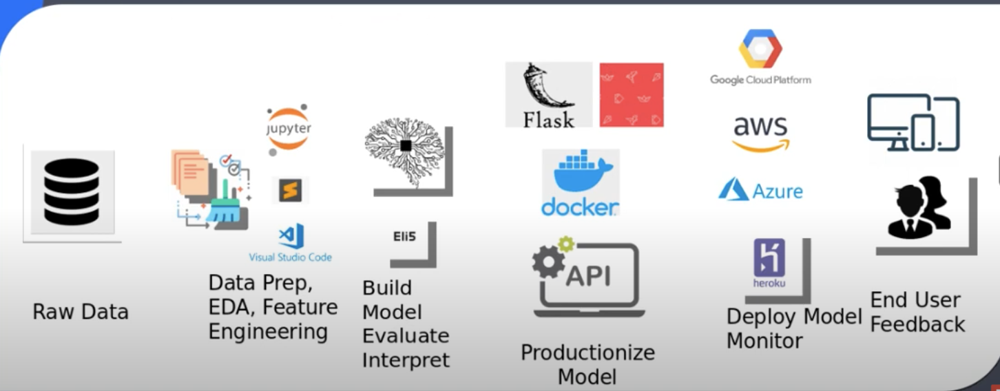
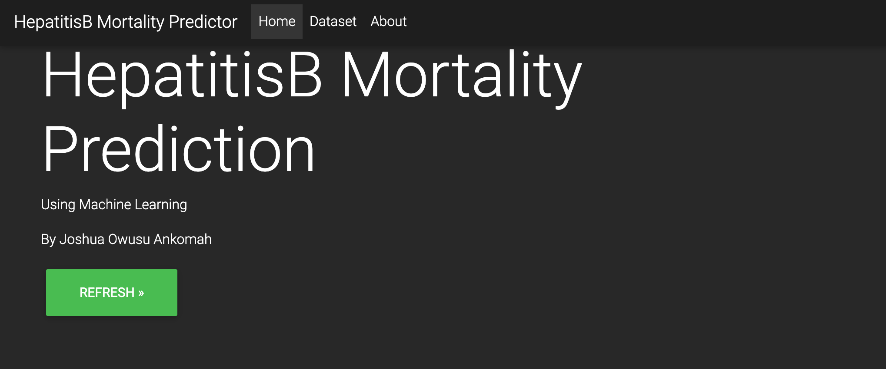
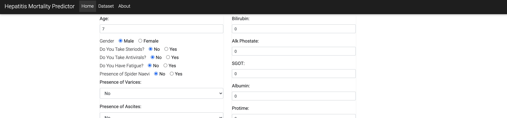
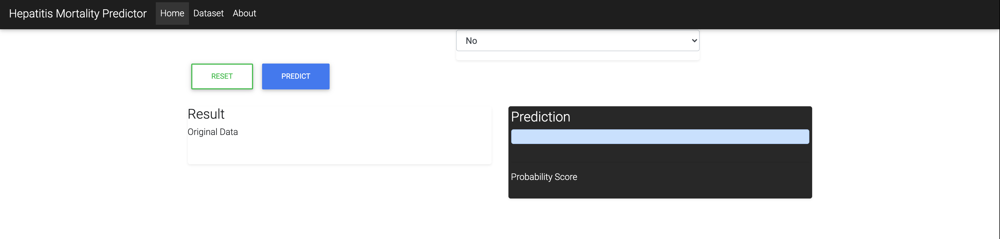

<!-- #region -->
# Predicting HepatitisB Mortality Rate.

# Author : Joshua Owusu Ankomah.

# DataSource : UCI Machine Learning Reporsitory.
https://archive.ics.uci.edu/ml/datasets/Hepatitis

-blue.svg)  

• This repository consists of files required to deploy a ___Machine Learning Web App___ created with ___Flask___ and ___StreamLit___ .


# Deliverables: 
- Predict if a patient will live or die based on the parameters using Machine Learning.

### Workflow.
+ Data Prep
+ EDA
+ Feature Selection
+ Build Model
+ Interpret Model
+ Serialization
+ Productionize with Streamlit and Flask

## End-to-end Workflow.



<!-- #endregion -->

## Installation.
The Code is written in Python 3.6. However ,version 3.7 is also supported by the modules. 
If you don't have Python installed you can find it [here](https://www.python.org/downloads/). If you are using a lower version of Python you can upgrade using the pip package, ensuring you have the latest version of pip. To install the required packages and libraries, run this command in the project directory after [cloning](https://www.howtogeek.com/451360/how-to-clone-a-github-repository/) the repository:

# Create a new environment to avoid clashes or errors.
+ For example I can create a new environment called Blablabla with python version 3.6

```bash
conda create -n Blablabla python=3.6
```

# To activate the environment.

```bash
conda activate Blablabla
```

+ next you can use pip freeze to get the libraries I have used in this project
+ or you can use pip freeze > requirements.txt before typing in the code below

```bash
pip install -r requirements.txt
```

# To run the flask App on your local machine.
+ cd into my_flask_app folder then try the code below

```bash
python app.py
```


```bash

```


# Disclaimer : 

## Since this is a health APP , I emulated a real life programme in a hospital where an employee will login to the StreamLit APP before given access to patient information. This follows the GDPR rules of Protecting client data. Hence patient confidentiality.         However ,the flask APP does not prior registration to login.

```bash

```

## The App's Interface (wireframe 1).




## wireframe 2 - Select features.




## wifreframe 3 - Prediction.




## About APP

+ I built the APP using Streamlit - Check out the APP in my_app folder.
+ Same APP has been built using flask from end to end in the my_flask_app folder.


[](https://flask.palletsprojects.com/en/1.1.x/) [](https://gunicorn.org) [](https://www.streamlit.io/)
[](https://mysql.com/)
[](https://jquery.com/)


```bash

```

## Additional information - Docker video from Krish Naik
+ I also created a docker container for the APP after watching this amazing tutorial from 
Krish Naik . You can find it in his docker playlist [here](https://www.youtube.com/watch?v=cDwsaQoP4Lk&list=PLZoTAELRMXVNKtpy0U_Mx9N26w8n0hIbs&index=6)

```bash

```

```bash

```

<!-- #region -->
**Version Control:**  One and only GitHub :heart:

**Language for this project:**  Python 


Please feel free to keep in touch if you have any queries or would like us to work together on a fun project :wink: 


### Connect with me

[](https://www.linkedin.com/in/joshua-owusu-ankomah-2b5a9898/)  [](https://github.com/code-JOA)  []() [](https://www.instagram.com/jay_rockerfella/)

<!-- #endregion -->

```bash

```

## Acknowledgement
+ My Data Science journey could not have manifested without my good friends Gyesi , Johnny Parker, Krish Naik, Jiwitesh , Ashray Shetty , Andrie Neagaie , Daniel Bourke , Ken Gee and the whole iNueron support team. 

```bash

```

```bash

```
## Thank you.
